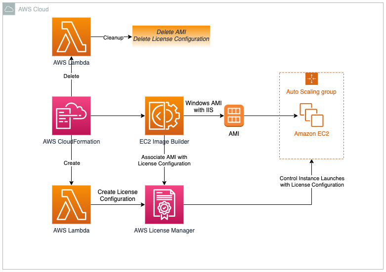

## AWS License Manager with EC2 Image Builder Demo
The purpose of this repository is to demo how to control vendor software licenses using AWS License Manager and EC2 Image Builder. 

###  Requirements
  - If this is the first time you are using AWS License Manager, create [a service-linked role for License Manager](https://docs.aws.amazon.com/license-manager/latest/userguide/license-manager-role.html#create-service-linked-role-service-action-1)

### Architecture


###  Launch the AWS CloudFormation Stack

Click on the **Launch Stack** button below to launch the CloudFormation Stack to set up the AWS License Manager with EC2 Image Builder Demo in the region of your preference, by default this demo will be deployed in us-west-2 (Oregon) region.

[](https://us-east-2.console.aws.amazon.com/cloudformation/home?region=us-east-2#/stacks/quickcreate?templateUrl=https%3A%2F%2Faws-license-manager-with-image-builder.s3-us-west-2.amazonaws.com%2Fmain.yaml&stackName=aws-license-manager-with-image-builder&param_AllowedIP=0.0.0.0%2F0&param_PublicSubnet1CIDR=10.10.10.0%2F24&param_PublicSubnet2CIDR=10.10.11.0%2F24&param_VpcCIDR=10.10.0.0%2F16)

Provide a stack name eg **aws-license-manager-with-image-builder**.

You can launch the same stack using the AWS CLI. Here's an example:

```
aws cloudformation create-stack --stack-name aws-license-manager-with-image-builder \
   --template-body file://main.yaml \
   --capabilities CAPABILITY_NAMED_IAM \
   --region us-west-2
```

### Edit AutoScaling Group to create more instances
- Go to AutoScaling Group, change max and desired values to 2
- Check AutoScaling Activity tab to see the errors due to license configurations

###  Clean up
After completing your demo, follow these instructions to remove all resources:

- Disassociate your AMI from License Manager
- Delete CloudFormation template

## Security

See [CONTRIBUTING](CONTRIBUTING.md#security-issue-notifications) for more information.

## License

This library is licensed under the MIT-0 License. See the LICENSE file.
